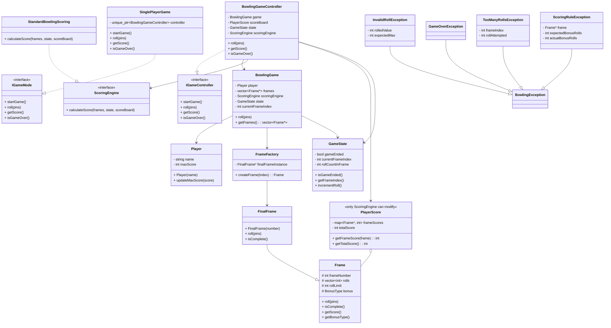

Snippet

# Bowling Game – Design Document
> Author: ***Pranav Prakash Jha***
> [LinkedIn](https://www.linkedin.com/in/pranavprakashjha/) | [+91 7797891003](https://wa.me/917797891003?text=Hey%20Pranav%2C%20I%20got%20your%20contact%20from%20your%20GitHub%20page)
 
## Overview
This project implements a console based **Single Player Bowling Game**, written in C++ using object-oriented principles and design patterns. The system supports standard ten-pin bowling rules, including strike/spare bonuses and final-frame rules, while remaining open to future extensions like multiplayer support or alternate game types.
 
## Problem Statement
 
Design a C++ program to compute the score of a single player in a ten-frame bowling game, adhering to official scoring rules:
 
### Game Rules Summary
- A **frame** is one **turn** a player gets to roll the ball and attempt to knock down **10 pins** arranged at the end of the lane.
- Each **bowling game consists of 10 frames** per player.
- In each of the first **9 frames**, the player gets up to **2 rolls (throws)**
-   **Final frame** rules are special, may allow up to 3 rolls:
    
    -   If strike/spare → extra roll(s) allowed **within the frame**.
        
    -   No bonus applied **from next frame**, as there is none.
 
- If all 10 pins are knocked down on the **first roll**, it’s a **Strike**, and the frame ends immediately.        
- If not all pins are knocked down on the first roll, the player gets a **second roll** to try and knock down the remaining pins.
- If all 10 pins are knocked down **across both rolls** (in total when both the rolls are done), it’s called a **Spare**.
-   A **Spare** gives a bonus of the **next 1 roll’s pin count**.
    
-   A **Strike** gives a bonus of the **next 2 rolls’ pin counts**.
 
## Design
This section explores the rationale behind the overall architecture of the Bowling Game system. It follows core OOP principles — **encapsulation**, **modularity**, **open/closed principle**, **composition over inheritance**, and employs **Strategy** and **Factory** patterns where appropriate.
 
### Namespaces
 
 	namespace Game {
	    namespace Controllers {
	        class IGameController;
	        class BowlingGameController;
	    }
 
	    namespace Modes {
	        class IGameMode;
	        class SinglePlayerGame;
	        // class MultiPlayerGame;
	    }
 
	    namespace Bowling {
	        namespace Core {
	            class Player;
	            class Frame;
	            class FinalFrame;
	            class FrameFactory;
	        }
 
	        namespace Engine {
	            class BowlingGame;
	            class GameState;
	        }
 
	        namespace Scoring {
	            class ScoringEngine;
	            class StandardBowlingScoring;
	            class PlayerScore;
	        }
 
	        namespace Exceptions {
	            class BowlingException;
	            class InvalidRollException;
	            class GameOverException;
	            class TooManyRollsException;
	            class ScoringRuleException;
	        }
	        namespace Tests {
	            class FrameTest;
	            class BowlingGameTest;
	            class ScoreEngineTest;
	            class ExceptionTest;
		    }
	    }   
    } 
### Class Diagram

 
### High-Level Structure
The entire codebase is logically partitioned under the root namespace `Game`. Sub-namespaces organize responsibilities into Controllers, Modes, and the Bowling domain. This ensures that code is cleanly modular and future game types or modes can be integrated with minimal disruption.
 
- **namespace `Game`**
	- **namespace `Game::Controllers`**
		- **class `IGameController`**
			- An interface representing the control layer of a game instance. It ensures that all game controllers (e.g., Bowling, Chess, Multiplayer Bowling) follow a common start–roll–score–end lifecycle.
		- **class `BowlingGameController`**
			- A concrete controller that implements the control flow for a single bowling game. Handles inputs, triggers rolls, and interacts with the `Engine` and `Scoring` layers.
			- Encapsulates business logic outside of game models. Allows external UIs (CLI, GUI, web) to interact with the game through a consistent façade.
    - **namespace `Game::Modes`**
	    - **class `IGameMode`**
	    Abstract interface for different gameplay modes — single-player, multiplayer, team play etc.
	  - **class `SinglePlayerGame`**
	  `SinglePlayerGame` acts as a **facade**, exposing minimal API (`startGame()`, `roll(pins)`, `getScore()`, `isGameOver()`), and delegates all orchestration to the controller.
	  `SinglePlayerGame` does **not** track game progress or scoring logic directly.
		  - Holds a `std::unique_ptr<BowlingGameController>`
	- **namespace `Game::Bowling`**
	This is the domain-specific core. It is further broken down into `Core`, `Engine`, `Scoring`, and `Exceptions` to promote separation of concerns and scalable code organization.
		- **namespace `Game::Bowling::Core`**
			- **class `Player`**
				- Encapsulates player metadata (e.g., name, max score). Keeps score-related data decoupled from the game logic for reuse across games/modes.
			- **class `Frame`**
				- Base class for all bowling frames. Tracks roll values, frame number, score, and bonus status (`Normal`, `Spare`, `Strike`).
			- **class `FinalFrame`**
				- Inherits from `Frame`. Overrides roll logic to allow up to 3 rolls and handle final-frame-specific rules (e.g., bonus rolls after strike/spare).
			- **class `FrameFactory`**
				- Creates either a `Frame` or a `FinalFrame` based on the frame index (1–9 vs. 10).
				- Enforces singleton behavior for `FinalFrame` via internal tracking or pattern.
 
		- **namespace `Game::Bowling::Engine`**
			-  **class `BowlingGame`**
				- The heart of the bowling logic. Maintains the player, current frame index, the list of frames, and integrates with the scoring engine.
				- **Key Methods:**
					-  `roll(pins)`: Processes a roll for the current frame.
					- `getTotalScore()`: Delegates to the scoring engine.
			- **class `GameState`**
				- Tracks gameplay state only (not scoring).
				- Used by the controller and engine to determine game flow and roll validity
				- Keeps scoring concerns decoupled.
				- Attributes:
					- `int currentFrameIndex`
					- `int rollCountInFrame`
					- `bool isGameEnded`
		- **namespace `Bowling::Scoring`**
			Implements the **Strategy pattern** to separate scoring logic.
			- **class `ScoringEngine`** (Interface)
			Provides a contract for score computation. Promotes interchangeable scoring algorithms (e.g., standard, practice, arcade mode).
			- **class `StandardBowlingScoring`**
			Implements scoring logic as per official bowling rules:
				- Adds next 1 roll for spare
				- Adds next 2 rolls for strike
				- Handles chaining strikes/spares properly
			- **class `PlayerScore`**
			Tracks cumulative and per-frame score breakdown for a player.
				-	**Single source of truth** for all score data.
				-	Only the `ScoringEngine` can modify it (enforced via access control / friendship if needed)
				-	Support for **per-frame score linkage** (e.g., `map<Frame*, int> frameToScore` or similar)
		- **namespace `Bowling::Exceptions`**
		Each exception represents a specific failure mode, enabling clear and maintainable error handling.
			- `BowlingException`: Base class for all bowling-specific exceptions.
			- `InvalidRollException`: Thrown when an invalid pin count (e.g., >10) is rolled.
			- `TooManyRollsException`: Thrown when rolls exceed allowed frame limit.
			- `GameOverException`: Raised when actions are attempted after the game is complete.
			- `ScoringRuleException`: Covers edge-case logic errors in scoring (e.g., broken bonus chain).
			-   `TooManyRollsException`: include frame index and roll number
			-  `InvalidRollException`: include actual vs expected pin count
			-  `ScoringRuleException`: include bonus breakdown that failed
    
    
## Build Systems
This project uses CMake and has been configured and tested to run easily in Visual Studio Code or Visual Studio 2022.
CXX version: 20.
 
 ## Output
	+--------+------------+-----+------+------------+------------+-------------+
	| Frame  |   Rolls    | Raw |Bonus | FrameTotal | Cumulative |  BonusType  |
	+--------+------------+-----+------+------------+------------+-------------+
	|      1 | 1 4        |   5 |    0 |          5 |          5 | -           |
	+--------+------------+-----+------+------------+------------+-------------+
	|      2 | 4 5        |   9 |    0 |          9 |         14 | -           |
	+--------+------------+-----+------+------------+------------+-------------+
	|     ^3 | 6 4        |  10 |    5 |         15 |         29 | Spare       |
	+--------+------------+-----+------+------------+------------+-------------+
	|     ^4 | 5 5        |  10 |   10 |         20 |         49 | Spare       |
	+--------+------------+-----+------+------------+------------+-------------+
	|     *5 | 10         |  10 |    1 |         11 |         60 | Strike      |
	+--------+------------+-----+------+------------+------------+-------------+
	|      6 | 0 1        |   1 |    0 |          1 |         61 | -           |
	+--------+------------+-----+------+------------+------------+-------------+
	|     ^7 | 7 3        |  10 |    6 |         16 |         77 | Spare       |
	+--------+------------+-----+------+------------+------------+-------------+
	|     ^8 | 6 4        |  10 |   10 |         20 |         97 | Spare       |
	+--------+------------+-----+------+------------+------------+-------------+
	|     *9 | 10         |  10 |   10 |         20 |        117 | Strike      |
	+--------+------------+-----+------+------------+------------+-------------+
	|     10 | 2 8 6      |  16 |    0 |         16 |        133 | -           |
	+--------+------------+-----+------+------------+------------+-------------+
	Final Score: 133
	Game Over! Final Score: 133

 
---
#### Tools Used to create this Readme file
> .md file edited in [StackEdit](https://stackedit.io/).
> Diagrams created in [Mermaid | Diagramming and charting tool](https://mermaid.js.org/#/).
